点开今年的红包，还是熟悉的配方，还是熟悉的味道。这个祖传红包页面沿用至今，但确实挺好用的。只不过这次点开红包的“开”按钮，显示的内容却是短小精悍的一句话：

> 笑死，根本没有红包。Soha正忙着在foobar院新年红包研究所干活呢。明年再来看看吧。

伴随着这句话的出现，还有音乐响起，不过那个不是主线任务，我们之后再说。

注：下面所述发稿时间以 2023-01-26T17:00+0800 为准。

# 第一关 进入研究所

简简单单的一句话，再没有任何其他的信息，那么这句话就是线索。很多人觉得这句话没头没脑，无从下手。甚至还有人认为 foobar 暗示的是 foobar2000 这个经典播放器，所以都跑去研究彩蛋红包那段音频去了。在设计这一关的时候我也没有想到这一层，一个玩家提醒了我才知道，因此赶紧加了一段说明。

我们来对这句话抽丝剥茧：笑死、根本、没有、红包、Soha、正忙着、干活、明年、再来、看看，这几个词大家都知道是啥意思。只剩下“foobar 院新年红包研究所”这一个没头没脑的机构名称放在这里。

不知道？搜呗。我在开始 7 小时后也增加了这个提示：“不知道的东西就问问万能的搜索引擎吧！”。当然可能每个人选用的搜索引擎都不一样，短短的时间里面也没能让他们来收录，但用户量较大的Google是可以搜索出来的。接着就可以从搜索结果进入一个名为“foobar 院新年红包研究所·所内综合办公系统”的网页。

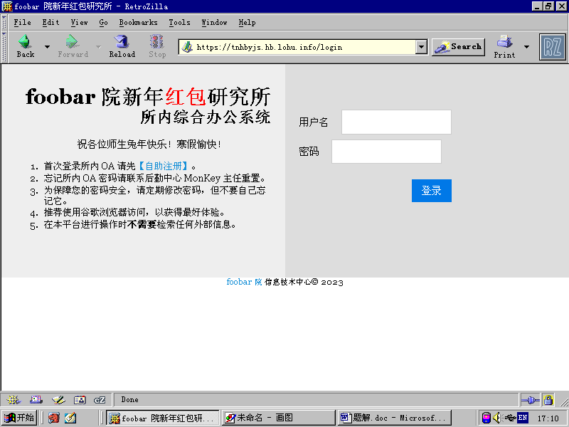

这个页面内容很简单，只有一个登录表单和一个注册表单的链接。一般来说，肯定会先尝试一下弱口令之类的，接着用引号之类的尝试找注入点，但这些都没有*（除了刚开始的时候有个人注册了 admin/123456 这个用户，让一些玩家绕过注册白捡红包一个）*。后来我看到依旧有人顶着 1 request/s 的限制在尝试 SQLMap 时，增加说明了“不涉及任何暴力解法”。

登录行不通，那么这时候就该考虑另一条路了：这个系统一看就是专门为这次红包设计的，如果不是红包有关的内容是没必要去做的。注册就是应该考虑的突破口。

打开注册表单，内容十分简洁。第一条就是学生和教职工身份的选择，学/工号后面是身份证后 6 位的验证。有些人认为这里是社工途径获得信息进行注册，这也是很自然的想法，但经过检索以后发现并没有这种资料。就只能从页面本身入手了。而实际上在代码实现的时候，只要申请的角色是学生和教职工，就[直接返回找不到](https://github.com/moesoha/red-packet-2023/blob/master/web/src/Controller/HomeController.php#L55-L63)，毕竟入口确实不在这里。

整个页面的代码真的很简单，一眼就能看穿。一开始我认为大家也都会看一眼引用的 JS 等，但开始后注册数量很倒闭，我觉得不太对劲。因此[移动了一下某 endif 的位置](https://github.com/moesoha/red-packet-2023/commit/74740f0ee6e441b2062185df7e6edd7284753194#diff-0a2b856b0158796fbc8da3a22c0bca760fd84601661bcc37fa3c15fe40ca0678)，故意放多一个 nbsp 出来，暗示还有一个隐藏角色。这个消息发布以后，一小时内多了 10 人注册。

查看引入的资源，发现只有一个 pure-min.css（外部库，就可以排除了）和 fe 文件夹下面的两个资源。CSS 看一眼发现啥都没有，但是 JS 就不一样了：这咋还有一个叫“keren”的 role 呢！

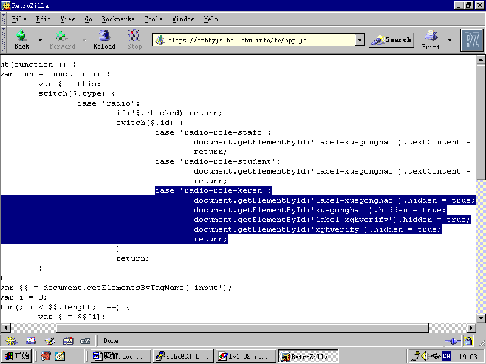

接下来就是利用审查元素修改角色值，接着忽略前两个字段填表完成注册。

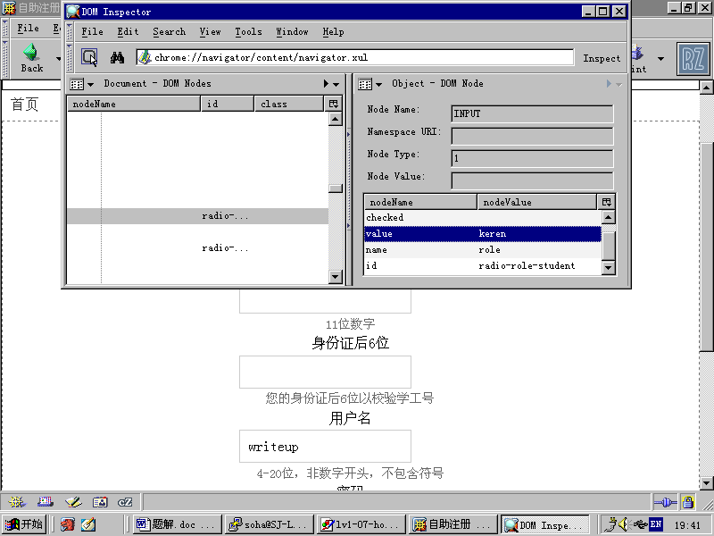

这里是直接看 JS 找到的第 3 个角色，如果我是用一台正常的电脑和正常的系统来写这个题解的话，我会直接用审查元素查看两个角色的单选框的 event listener，找到这个函数。这也是对于大型项目一般会使用的方法。

使用刚才注册成功的信息登录就能看到第一个红包口令了。

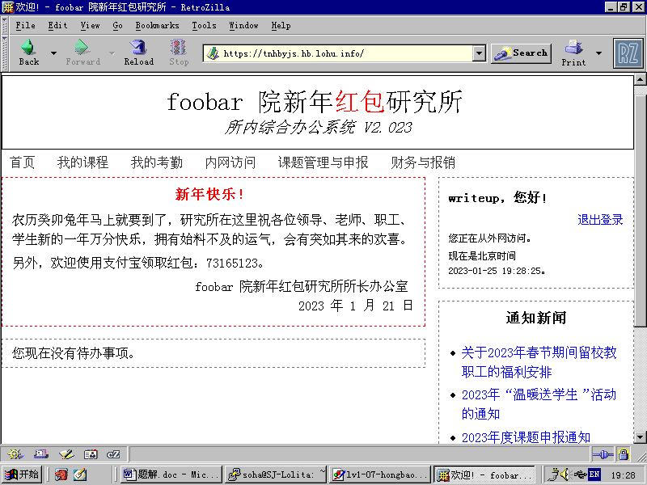

截至发稿，一共有 50 人尝试注册（以 `POST /zizhureg` 为准，按照 IP 统计，下同），27 人注册成功。红包原定发放 60 个，共 72 元，实际领取 27 个。根据 session 创建时间和注册的时间差，排除一些几十秒的离谱数据，最长用了一个小时，最短只用了几分钟，大部分用了 10-30 分钟。

# 第二关 摸进所内网

注册进入网站以后，就是到处摸、到处看的时候了。导航栏除了“内网访问”之外都是 403。通知新闻倒是能看，但是有几条显示“该内容仅限办公室查看”和“该内容仅限内网查看”，结合唯一可访问的“内网访问”以及右侧的“您正在从外网访问”，可以推断出题目的目的是获得内网访问权限。

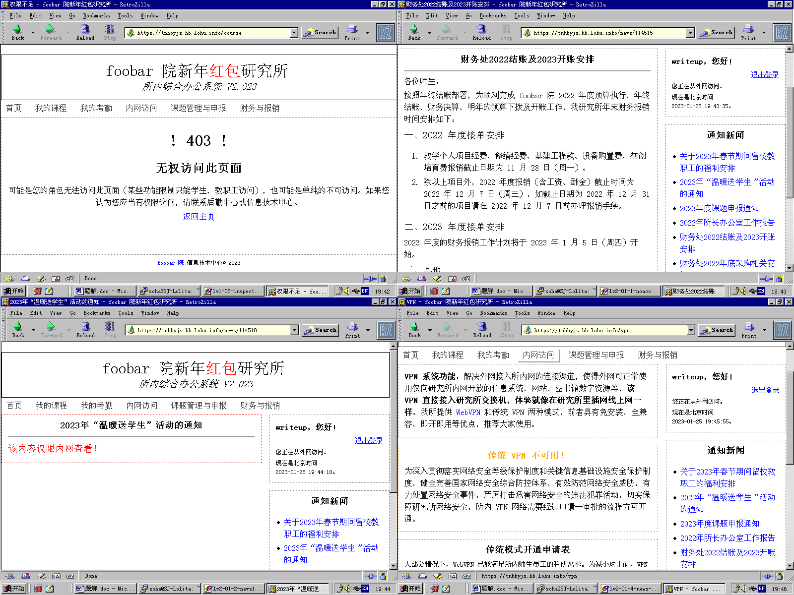

“内网访问”栏目是一个 VPN 的申请。这也是目前唯一能交互的地方了。申请表中用“管理员会很快审核你的申请”来暗示 XSS。首先先随便测试一下：

```html
<script>alert(1);</script>

```

这里并不是盲注，提交后的页面可以回显验证，在这里展示的内容和“管理员”看到的是一样的。上面的内容显示的时候会变成：

```html
alert(1);<br />

```

那么猜测这个系统在提交的时候会：

  1. 过滤 `<script>` 标签；
  2. 过滤标签内 `onXXX` 属性；
  3. 添加 `<br />`。*（当然这个和题目没关系。）*

接下来随意使用一些常见套路进行测试，我们也可以很容易发现它只对危险内容进行了一次过滤，并没有循环过滤，这是一个常见的错误。所以只要使用 `<scrip<script>t>` 这样的内容就能绕过：

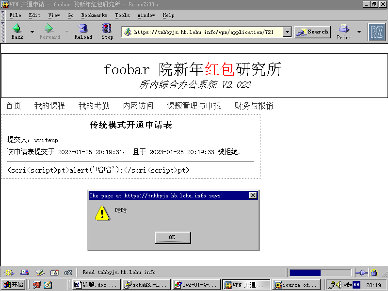

*（这里申请表中显示的代码是为了让大家直观看出而手动 escape 的。）*

既然能 XSS 了，那么接下来该怎么办呢？有些人一开始认为是偷 cookie 提权，不过测试后发现并没法用，因为我[用的是 IP 登录](https://github.com/moesoha/red-packet-2023/blob/master/web/src/Security/ReviewerIpAuthenticator.php#L29)。那么就该考虑怎么让自己的申请表通过了。该怎么让管理员通过自己的申请呢？这个页面上看不到任何表单，但是后面 script 给出了暗示：

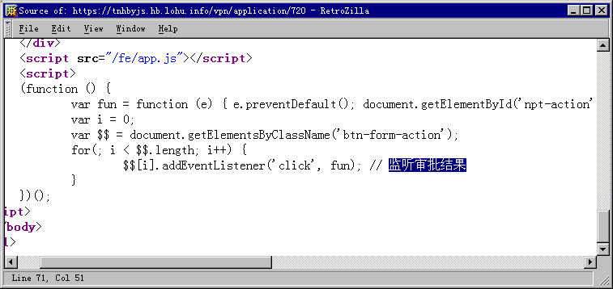

虽然审批表单检查了权限没有显示出来，但是下面辅助表单的 script 并没有放入判断，所以“漏”出来了，这是常见问题。

在这里我们就能看到管理员点下审核按钮的时候，这段代码会把 `#npt-action` 的值换成触发的 `.btn-form-action` 的 `data-action` 属性值，然后提交。最简单的解法就是猜出通过审批 action 的值，然后点击，这样的 payload 就是

```plaintext
<scri<script>pt>setTimeout(() => document.querySelector('.btn-form-action[data-action="accept"]').click(), 233);</scri<script>pt>
```

当然也可以不用猜，使用一些手段也可以把 HTML 代码偷到自己手里，只不过需要一个平台来反弹这些内容。这种平台可以自建（最简单就是 socat 快速开一个）、公开的也有不少，如果是了解 XSS 或者打 CTF 的人，那知道的肯定比我多。

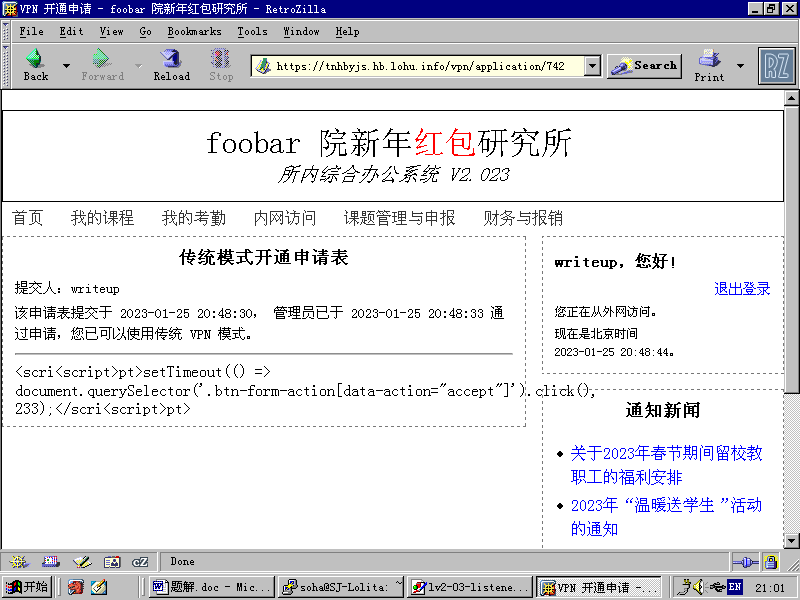

*（这里申请表中显示的代码是为了让大家直观看出而手动 escape 的。）*

还有一点需要注意，有一些朋友不太了解浏览器代码的执行顺序。可以看一下我之前测试 XSS 的图片，注意 alert 的时候，侧边栏是没有加载出来的。因为在执行那段恶意 script 的时候，浏览器还没执行到侧边栏的 DOM。同理，如果直接在这里操作按钮的 DOM，也没法成功，因为这个时候按钮还没被执行出来，当然是操作不了的。我上面的 setTimeout 是一个方法（方便但是不靠谱），监听 DOM 加载的事件，然后把操作放 callback 也是一种方法，都可以解决这个问题。我在看后台数据的时候发现很多朋友因为这个原因卡了很久，非常可惜。

这里在服务器端过滤内容时实际使用的[代码]是：

```php
$statement = preg_replace('/<\s*\/?\s*script(\s*|\s+[^>]*)\/?>/i', '', $statement);
$statement = preg_replace_callback(
	'/<\s*\S*(\s*|\s+[^>]*)\/?>/i',
	fn($matches) => preg_replace('/on[a-z]*\s*=\s*[\'"]?[^\'">]+[\'"]?/i', '', $matches[0]),
	$statement
);
```

在选择过滤敏感标签的方案时没有循环过滤是一个典型错误，这里的敏感内容也不够完整，`<iframe>` 这样的标签都还没有被排除。

审核是[自动审核机](https://github.com/moesoha/red-packet-2023/blob/master/level2/reviewer/index.mjs)完成的：用 puppeteer 来操作无头 Chrome，加载申请表后等待 1s，然后发送 reject 的请求。如果在这之前以任何形式成功发送了 accept，就是过关。

这里我还有 2 个锅：[第一个](https://github.com/moesoha/red-packet-2023/commit/3d18d44f9a67e2928eca08f2b5eba3f2816e9678)是没考虑 alert 之类的阻断情况，导致这样的输出会卡住审核机，同时没有在外面 try-catch，超时后就把整个程序卡退出了。[第二个](https://github.com/moesoha/red-packet-2023/commit/6adb167f1ecfc95b1d9761b24f6a73112826a228)是自动审核一开始也是点击按钮实现的，如果用户输入破坏了 HTML 结构，那么这张申请表也会卡在未审核，不过不会把整个程序卡出去。设计上是同时只能有一张申请表在审核，因此这两个问题会导致大家的申请表卡住，没法提交新的申请，还好这都是 foobar 院同事在刚开始不久的时候试出来的，没有影响其他人。

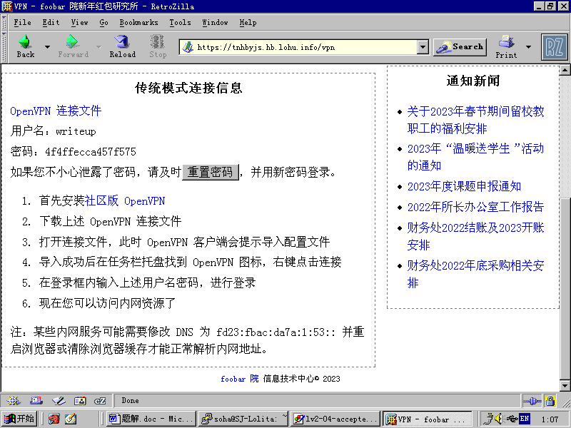

现在已经获得了 VPN 的连接信息，就可以连入内网了。装上 OpenVPN，导入配置（Linux 下是 `openvpn --config tnhbyjs-vpn.ovpn`），输入用户名和密码，换上内网 DNS。

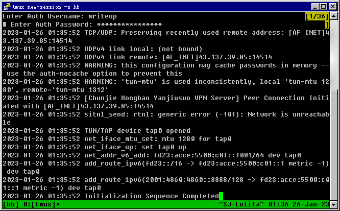

在这里演示的时候使用的是 NT 4.0，虽然它可以支持 IPv6，但装新一点的 OpenVPN 不太现实，加上第三关还是需要 Linux，因此我接下来将使用代理，通过 Linux 主机来访问内网，另外 Windows 10 及以上也可以使用 WSL 来完成第三关。

成功连接并修改 DNS 之后，重新进入系统，就可以发现这时候已经可以查看《2023 年“温暖送学生”活动的通知》了，同时右侧显示“您正在从内网访问”。

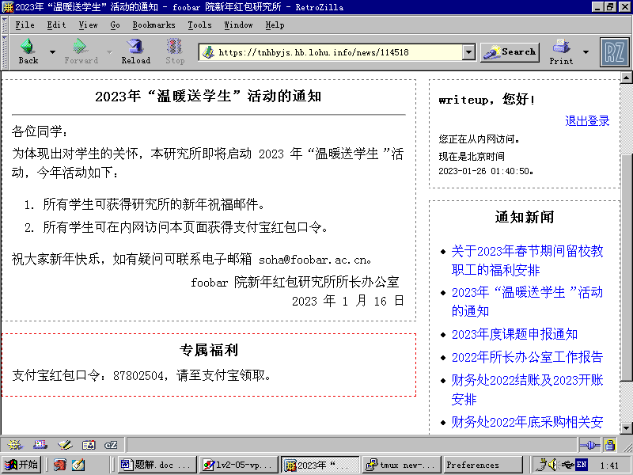

截至发稿，上述 27 人共有 12 人通过第二关。红包原定发放 36 个，共 88 元，实际领取 10 个（有 2 人超时完成）。根据注册时间和通过审批的提交时间差，大部分用时是在 1-2 个小时左右、尝试 30-40 次。最少的尝试 15 次、用时 7 分钟；最多的尝试 117 次，间隔 17 小时（中间肯定睡觉过了 233）；第二多的用时和最多的相近，但只尝试了 64 次。

# 第三关 闯入办公室

接下来就是最后一关了。新闻中还有 2 篇显示只能从办公室访问，那么怎么样才算是办公室呢？它是一个网站，网站该怎么判断用户的位置呢？当然是 IP 啦，不然还获取 GPS 权限吗。那么问题来了，什么样的 IP 才算是办公室呢？看了眼 OpenVPN 分配到的IP，是 `fd23:acce:5500:c01::1001`。有些人能够一眼看出地址中“`acce:5500`”是 access 的意思，是说这是接入网的网段，但是怎么变成办公室呢？

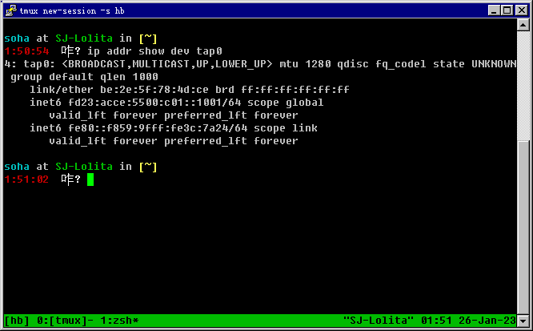

在这一关，OpenVPN 使用的 tap 模式是一个暗示，tap 是数据链路层的隧道，而一个 access VPN 显然没有必要，正常都是使用网络层的 tun 模式。这里是用 tap 暗示 VPN 是和研究所交换机接在一起的。这里的暗示确实隐讳了一点点，因此开始后不久我加入了“就像在研究所里插网线上网一样”的提示。结束前 6 小时又加入了“该 VPN 直接接入研究所交换机”的提示。

这就是暗示要抓包啦！有些学校/机构的网管没有做好隔离，把所有东西都放在一起喷。甚至内部网关协议(IGP，如 OSPF、RIP 等)的报文都在所有人可访问的广播域中乱喷。如果没有用上 IPSec 之类的鉴权手段的话，所有人都能通过这个来劫持路由。

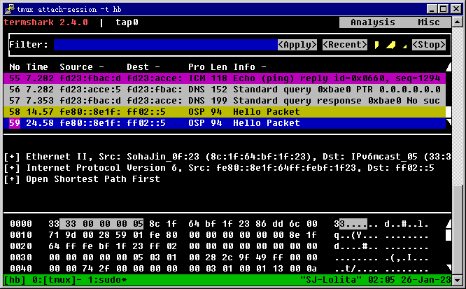

用上 Wireshark（这里是它的一个 TUI 版本，termshark）抓包，确实见到了 OSPF 的报文。这里还有个小彩蛋，有些人可能也注意到了，在 Ethernet 层的地址边上，源地址 8c:1f:64:bf:1f:23 的 vendor 被标注成了“Soha Jin”。这就是我在[《大步踏入 2023》](https://soha.moe/post/hello-2023.html)中提到的和万呆呆一起斥巨资向 IEEE 申请的 MAC 地址块。他今年出的红包也用上了自己的 MAC 地址。

发现了 OSPF 的 Hello Hello Hello Hello Hello Hello Hello Hello 报文之后该怎么办呢？当然是加入他们一起去 Hello Hello Hello Hello Hello Hello Hello Hello 呀。从对面发送的 Hello 报文中获得 area ID、instance ID 等必要参数，这时候就可以请出万能的 BIRD，使用下面的配置加入 OSPF 了：

```
protocol device {}
protocol ospf v3 {
	area 0 {
		interface "tap0" { cost 100; };
	};
	ipv6 {
		import all;
		export none;
	};
}
```

配置完成后等待一会儿让它们完成握手，我们就能在 BIRD 中看见研究所的内部路由了。

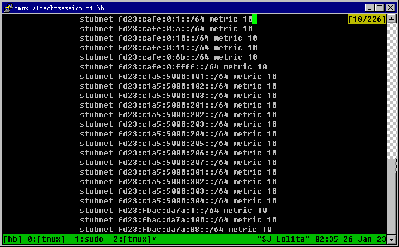

仔细研究这些路由，发现他们还是很有规律的：第 17-48 位都是一些单词。比如“`cafe:0000`”代表 café（咖啡馆），“`c1a5:5000`”代表 class（classroom，教室），“`fbac:da7a`”代表 foobar ac data（foobar 院数据中心）。其中还有一个“`0ff1:ce00`”代表 office（办公室），有的玩家因为没有注意到被省略的前导零而没能看出来。本来这里的“`0ff1:ce00`”是想让大家找规律猜出来自己填上的，但是连万呆呆在看出来这些单词的情况下都没理解我的意思，而以为是在这些前缀中找出代表办公室的，于是我就加了一条 `fd23:0ff1:ce00:101::/64` 当作提示降低难度了。

说到这里思路应该就清晰了：首先宣告一条 `fd23:0ff1:ce00::/48` 下面的/64 前缀，然后使自己通过这个前缀下面的一个地址访问，那么就是从办公室访问了。

要实现前者，只需要在 BIRD 的 OSPF 配置中的 area 0 部分加入一行（2333 部分可以自己定义）：

```
stubnet fd23:0ff1:ce00:2333::/64;
```

要实现后者，只需要执行下面的命令：

```shell
ip addr add dev tap0 fd23:0ff1:ce00:2333::3333/128
ip route add dev tap0 fd23:fbac:da7a::/48 via fd23:acce:5500:c01::1 src fd23:0ff1:ce00:2333::3333
```

其中 `fd23:fbac:da7a::/48` 是研究所网站所属的网段，`fd23:acce:5500:c01::1` 是 OpenVPN 推送的网关地址。`fd23:0ff1:ce00:2333::3333` 是自己指定的地址，第二行的 src 告诉内核访问这一条路由使用这个地址当作自己的源地址，这样我们访问研究所网站就会通过这个 IP 地址了。

再次访问之前不能访问的通知，就能看到红包口令了。右侧也显示“您正在从办公室访问”。通关！

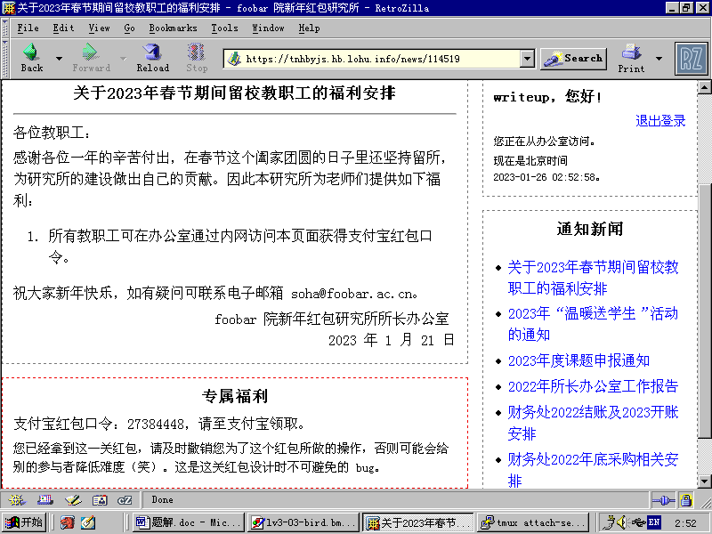

这次在领取后还有一段文字说明，要求获得后尽快撤销路由。因为 OSPF 的 LSA DB 是整个网络内所有的路由器一起维护的，如果你不及时撤销，别人也能看到你宣告了什么，那么别人也就能一下子知道怎么宣告地址了。

说到这个红包的思路，可就有趣了。2022 年的 D^3CTF 某个出题人出了一道题目，创意来自我 2021 年的红包的最后一部分，出题人还写了 Salute Soha，让我倍感荣幸。这道题目提供了一个 L2TP 隧道用来连接一个 MikroTik 路由器，只要进去和 OSPF 实例一起 Hello，就能获得编码过的红包口令。当时有人质疑出题方“这题目一点也不 CTF”，我听说了以后就[举了一个例子](https://t.me/sohadays/4474)：

> 在你的学校里插上网线，开启 tcpdump，没准就能看到一堆 OSPF Hello。你一起进去跟着 Hello 可能还可以把路由漏给学校的路由器来劫持路由。
>	
> *如果你的学校真的有这个问题，请及时上报负责部门。*

当时其实也就构思好了这道题目：需要通过劫持路由的方式来获得红包。

截至发稿，通过了第二关的 12 人共有 2 人通过第三关。红包原定发放 28 个，共 98 元，实际领取 1 个（有 1 人超时完成）。根据通过审批的提交时间与使用办公室 IP 第一次访问的时间差，两人分别用时 02:52:38、05:28:05。巧的是，这两人均来自清华大学。

# 后记

我自己对今年红包的设计和实现还是比较满意的，这是第一次以一个整体的形式呈现我的新年红包，其中包括了社工（搜索找到系统也算吧）、代码审计、XSS、路由劫持等思路。而且很接地气，就像五道口某学校一样，万呆呆表示：


只是红包的领取状况不容乐观，时间是很大一部分原因。这套系统我都设计了三天，24 个小时（囿于支付宝红包的限制）的游戏时间相比之下确实是短了点，况且虽然是过年，大家要出门玩啊要拜年啊，也没有这么空闲的。说难听点，这红包就这么两块钱（不考虑拼手气因素，平均下来通关是 6 元左右），也不是什么大奖，不太会安排在较高的优先级。

除了时间以外，红包数量也是一个问题。我不太能估计好总共应该发放多少个，因为不好确定究竟有多少人参与、有多少人成功。最好的办法应该是在结束后统一发放，支付宝红包口令的形式对于简单的小游戏来说还是挺好的，但是对于今年这样的就不适合了。其实这个问题在去年就已经显示出来了，因此我也在思考明年的游戏形式，希望能做到既要有参与感、也有一定的深度。

这个红包其实赶制得粗糙了点，一开始就修了一堆 bug，有兴趣可以看我 GitHub 仓库的 commit 记录，以后再出这样的题目是得先找人验题了。还有一个玩家在尝试第三关的时候，通过 Wireshark 发现了自己电脑上的异常流量，找到了 2 个恶意程序。虽然没领到红包，但也算是收获颇丰。

在我发布这篇文章之前，还有一个朋友通过了三关，虽然时间已经超过，但既然题解还没发布，便向其专门发放了。另外我把多出来的红包重新发了，在发稿之前过关的朋友，可以登录到平台查阅重新发放的红包口令。

这次红包的平台也会随着服务器的自然过期而倒闭，大家可以在半个月的时间内自由重新验证。

这篇题解除了需要连接现代版本 OpenVPN 和宣告路由的时候使用 SSH 连入了我的笔记本之外，均使用运行着 Windows NT 4.0 的 Intel Pentium 233MHz w/MMX + 64M EDO DRAM 内存的笔记本电脑完成。折腾这台电脑（即“老爷车”），是我红包咕咕咕的主要原因，我一直折腾它到大年廿九才导致红包来不及做。有关于折腾年前折腾这台笔记本的记录，我会把它另外写成一篇博文。

# 彩蛋红包

这次彩蛋红包和去年第三部分的解法一样，去年没人解出来，因此我重新在今年以彩蛋的形式再放送。相信只要翻阅过往年的题解的朋友都能做出来。

红包就是点击“开”后播放的音乐，解法就不赘述了，就是找出配和弦的音的简谱记法，感兴趣可以看去年的题解。今年只是谱子不一样：


输入“彩兔13443121”即可领取。原定使用 66.66 元发送 88 个，但只领走了 28 个。

关于这个彩蛋红包还有一个[大锅](https://github.com/moesoha/red-packet-2023/commit/0722fd3d884c769224a519b821cc12b602238b5a)：我一般都是提前把口令生成好写在 _idea.txt 文件里面。这次因为是直接复制了去年的文件夹，虽然我改了谱子，但是没有更新 _idea.txt，导致我错误地使用了去年的口令发送了红包，直到被人提醒才知道。有趣的是，正当我撤回发错的红包准备重新发的时候，发现正确的红包口令居然被人占用了：是一个玩家以“看看有多少人领”的红包说明发了一个正确的，令我哭笑不得。联系上他撤回红包后，发现红包口令释放也没有这么快，估计也得过一两天。于是只得把前缀从“兔”改为“彩兔”。